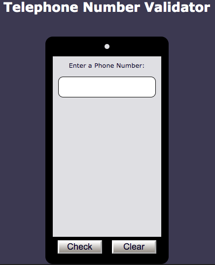

End: 01January2023 
Build a Telephone Number Validator:  
In the US, phone numbers can be formatted in many ways. Here are some examples of valid formats for US phone numbers:  

1 555-555-5555  
1 (555) 555-5555 
1(555)555-5555 
1 555 555 5555 
5555555555 
555-555-5555 
(555)555-5555 
Note that the area code is required. Also, if the country code is provided, you must confirm that the country code is 1. 

Objective: Build an app that is functionally similar to 

Link/Preview:
https://telephone-number-validator.freecodecamp.rocks/ 
https://www.freecodecamp.org/learn/javascript-algorithms-and-data-structures-v8/build-a-telephone-number-validator-project/build-a-telephone-number-validator 
=========================================================================
End: 24December2023  
Telephone Number Validator :  
Return true if the passed string looks like a valid US phone number.  
The user may fill out the form field any way they choose as long as it has the format of a valid US number.  

Link/preview:  
https://www.freecodecamp.org/learn/javascript-algorithms-and-data-structures/javascript-algorithms-and-data-structures-projects/telephone-number-validator

